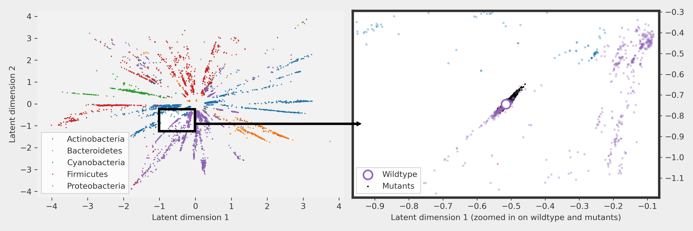
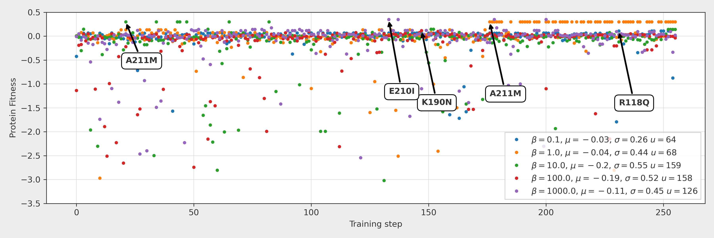

<p align="center">
    <h2>:pill: Guiding directed protein evolution with Bayesian Optimization :pill:</h2>
</p>



In this project we looked into a possibility of improving the current direct evolution workflow by reducing the experimental effort associated with directed protein evolution. By incorporating Variational Autoencoders, a novel unsupervised deep generative model and Bayesian Optimization we seek to reduce the number of expensive experiments needed to find the target protein with desired properties. 

Starting with a discrete sequence of amino acids of our protein of choice (the wildtype) and it’s multiple-sequence-aligned neighboring sequences, we use a VAE to learn a non-linear mapping from discrete sequence of aminoacids into a latent continuous space. We then use Bayesian Optimization in the latent space to propose promising changes to the wildtype protein. 

The proposed approach is validated on a large published emperical fitness landscape for all 4997 single mutations in TEM-1 β-lactamase selecting for the wild-type function (Stiffler et al., 2015). 

We learned that our VAE+BO approach significantly outperforms random mutant selection as it easily finds at least two of the best 9 mutants in less than 200 steps.

## Result in a single plot

Optimization progress across 5 experiments with varying β (exploitation-exploration tradeoff hyperparameter). In all experiments, the Bayesian Optimization procedure manages to suggest highly relevant mutations as seen by the high value of μ - the mean value of the fitness of the suggested targets. Arrows point to the first occurrence of the best mutant in the experiment. The procedure successfully manages to find 2 out of 3 top mutants.

## Running the code
```
main.py <number_of_latent_dimensions: 2, 5, 8, 16, 30> 
```

## Full paper
[:page_facing_up: Full paper](paper.pdf)